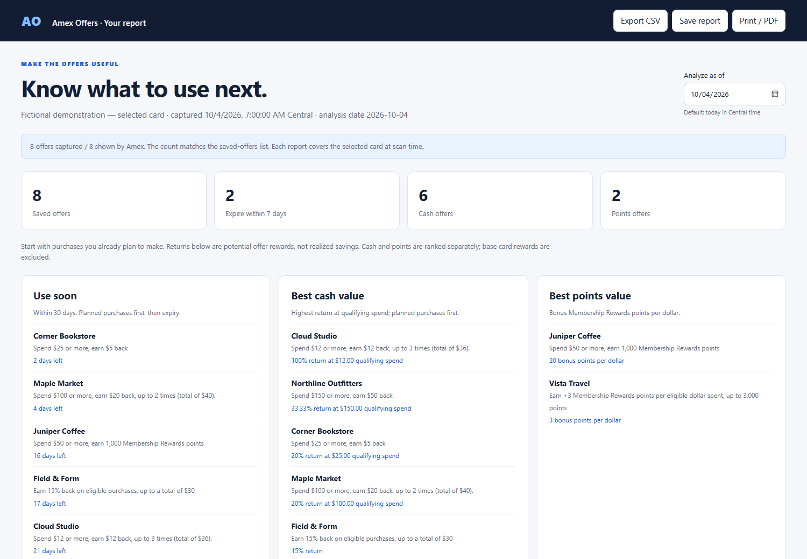
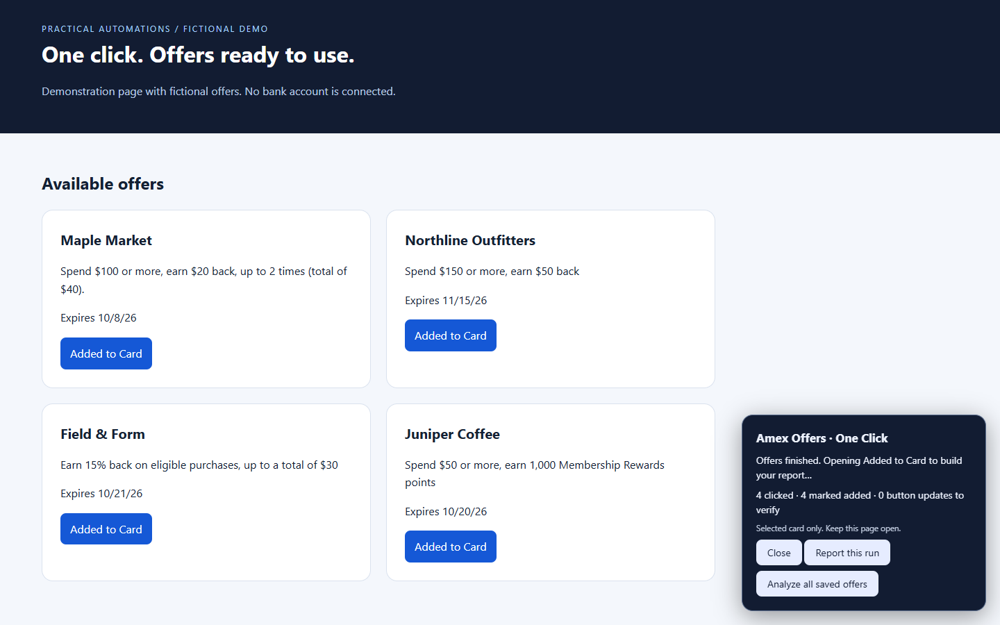

# Practical Automations

[](https://github.com/KarT-yl/practical-automations/actions/workflows/ci.yml)
[](LICENSE)

Small tools that remove repetitive work and turn information into something useful. Includes **MyTE Hours Filler**, **Amex Offers — One Click + Reports**, and the **Natural Voice Editor** writing skill.

## Natural Voice Editor

The reusable writing instructions I use to preserve my voice, remove generic phrasing, and check that edits stay faithful to my facts. Includes an exact copy of the skill, a downloadable ZIP, a before-and-after example, and guidance for using its instructions in ChatGPT or Claude.

**[Get the skill and usage instructions](skills/natural-voice-editor)**

## MyTE Hours Filler

Fill a standard weekday schedule in MyTE's Working Hours window, skip listed days off, and review the entries before saving yourself. The original four source files are preserved alongside a separate improved version with stricter validation and local-only settings.

**[Download MyTE v1.0.2](https://github.com/KarT-yl/practical-automations/releases/tag/myte-v1.0.2)** · **[Install and understand the code](tools/myte-hours/README.md)** · **[Exact original source](tools/myte-hours/original-v1.0.1)**

Independent personal tool; no employer endorsement is implied. Automated validation uses synthetic pages, not a signed-in workplace session.

## Amex Offers — One Click + Reports

Add available offers on your selected American Express card with one click, then see which saved offers expire soon and offer the strongest cash or points return. Works with offers you saved manually, too.



**[Download the Amex extension](https://github.com/KarT-yl/practical-automations/releases/tag/v2.0.1)** · **[Installation and usage](tools/amex-offers/README.md)** · **[View a sample report](docs/demo-report.html)** · **[Comparison with paid tools](docs/COMPARISON.md)**

The sample report is a standalone HTML file: download it and open it in your browser. Every example and screenshot uses fictional data.

### What it does

- Adds eligible offers sequentially, with visible progress and a Stop button.
- Scans the selected card's **Added to Card** list, including offers saved before installing the extension.
- Shows expiry dates, qualifying spend, stated rewards, caps, and repeated uses when the summary is clear.
- Ranks cash rewards and Membership Rewards points separately. Prioritizes purchases you already plan to make.
- Exports CSV and standalone HTML, or prints to PDF.
- Keeps the latest ten reports in local browser storage. No subscription, service account, analytics, or external report service.

### Install in Opera GX

1. Download `amex-offers-one-click-v2.0.1.zip` from the [latest release](https://github.com/KarT-yl/practical-automations/releases/tag/v2.0.1).
2. Extract it into a permanent folder.
3. Open `opera://extensions`, enable **Developer mode**, and choose **Load unpacked**.
4. Select the extracted folder containing `manifest.json`, then pin the extension.
5. Sign in to Amex normally, select your card, open **Offers → View All → Available**, and click the extension icon. Leave the page open while it runs.

For offers already saved, open **Added to Card → View All** and click the icon to scan and report. After an update, reload the extension **and refresh the Amex tab**.



### Where it fits

A free, open-source option for the specific **Amex enrollment + local report** workflow. CardPointers, MaxRewards, and CardStack offer broader card management, more banks, syncing, or reminders. This project has narrower scope; it does not replace those entire products. See the [sourced comparison](docs/COMPARISON.md).

### Practical limits

Designed for English-language U.S. Amex pages in Chromium browsers, including Opera GX, Chrome, and Edge. Automated tests use synthetic pages; current authenticated Amex compatibility has not been verified in this update. Site changes can break selectors. Work on one selected card at a time; this tool does not choose which card should receive an offer.

Reports analyze visible summaries. They do not track purchases, redemptions, remaining caps, or realized savings. Complex conditions need manual review. Always read the full terms on Amex. This project is independent and is not affiliated with American Express.

## Repository layout

```text
tools/amex-offers/extension/   Load this folder in your browser
tools/amex-offers/README.md    Detailed setup and troubleshooting
tools/myte-hours/extension/   Improved timesheet helper
tools/myte-hours/original-v1.0.1/ Exact supplied source
docs/                        Comparison, architecture, fictional demo
tests/                       Calculation, UI, collector, and integration checks
scripts/                     Test runner, demo generation, release packaging
```

## Development

Installation does not require Node.js. For development, use Node.js 20+ and npm:

```sh
npm ci
npx playwright install chromium
npm test
npm run format:check
```

`npm run demo` regenerates the fictional screenshots and report. `npm run package` creates the extension ZIP under `artifacts/`. Browser tests intercept all Amex requests with fixtures; they do not sign in to a bank. To use an installed Edge browser locally, set `PLAYWRIGHT_CHANNEL=msedge`.

See [architecture and validation](docs/ARCHITECTURE.md), [contributing](CONTRIBUTING.md), and [privacy](docs/PRIVACY.md). Licensed under [MIT](LICENSE).
