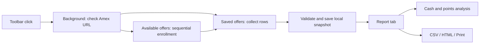

# Architecture and validation

The extension uses plain JavaScript, HTML, and CSS. There are no production packages, build step, server, API keys, or model calls. Analysis is deterministic, not generated by AI.

## Modules

| File             | Responsibility                                                                             |
| ---------------- | ------------------------------------------------------------------------------------------ |
| `background.js`  | URL/sender validation, action routing, saved-list navigation, local snapshots, report tabs |
| `bridge.js`      | Background readiness handshake, bounded messaging, update/reload errors                    |
| `offer-data.js`  | Offer-row extraction, identity, snapshot construction                                      |
| `offers.js`      | Sequential enrollment, progress, stop conditions, run reports                              |
| `scan-report.js` | Saved-list scanning, lazy loading, Show More, coverage checks                              |
| `analysis.js`    | Pure reward/date parsing, exclusions, ranking                                              |
| `report.js`      | Rendering, filters, planned purchases, safe exports, local deletion                        |

## Calculations

- Fixed cash reward: reward / qualifying spending threshold. Example: spend $100, get $20 → 20% at the threshold.
- Percentage reward: use the stated rate. Spend needed to reach a stated cap = cap / rate.
- Repeated fixed reward: use the stated repeat count and total cap when the summary supports it.
- Fixed points reward: bonus points / qualifying spending threshold. Example: spend $50, get 1,000 MR points → 20 bonus points per dollar.
- Per-dollar points: use the stated bonus rate. Base card points are excluded.
- Expiry: calendar-day difference from the adjustable analysis date. The default date is today in America/Chicago.

Cash and points are never converted into one unit. Expired offers, unverified enrollment states, and complex/mixed conditions are excluded from recommendations. Planned purchases take priority. Caps assume no previous redemptions. Missing or ambiguous inputs stay unknown.

## Tests

`npm test` runs six suites:

1. Calculation/date boundaries and recommendation eligibility.
2. Background routing, sender validation, storage, and messages.
3. Seventeen enrollment scenarios, including real-style plus-button labels, duplicate clicks, navigation, Stop, dialogs, errors, lazy loading, and old-background mismatch.
4. Saved-list extraction, deduplication, Show More, coverage, and account-key exclusion.
5. Report filters, planned purchases, ranking, HTML escaping, and CSV formula protection.
6. A genuinely loaded extension with isolated content scripts, background messages, saved-list navigation, persistence, and report tabs.

Every automated Amex page is intercepted and replaced with synthetic HTML. Only the integration test's temporary copy receives a fixture host permission; the shipped manifest does not. The real Opera GX enrollment workflow and a complete saved-list scan were also checked during development. Automated fixtures cannot guarantee compatibility after Amex changes its page structure.
